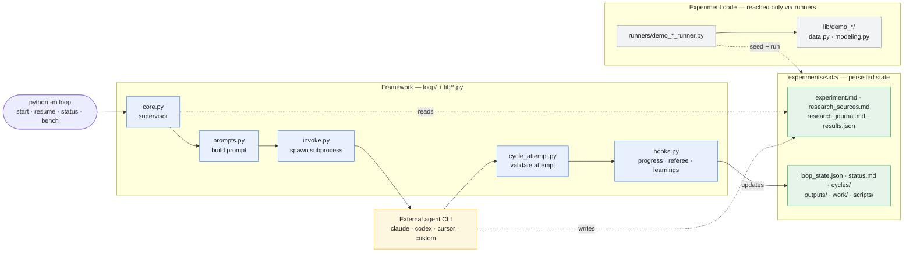
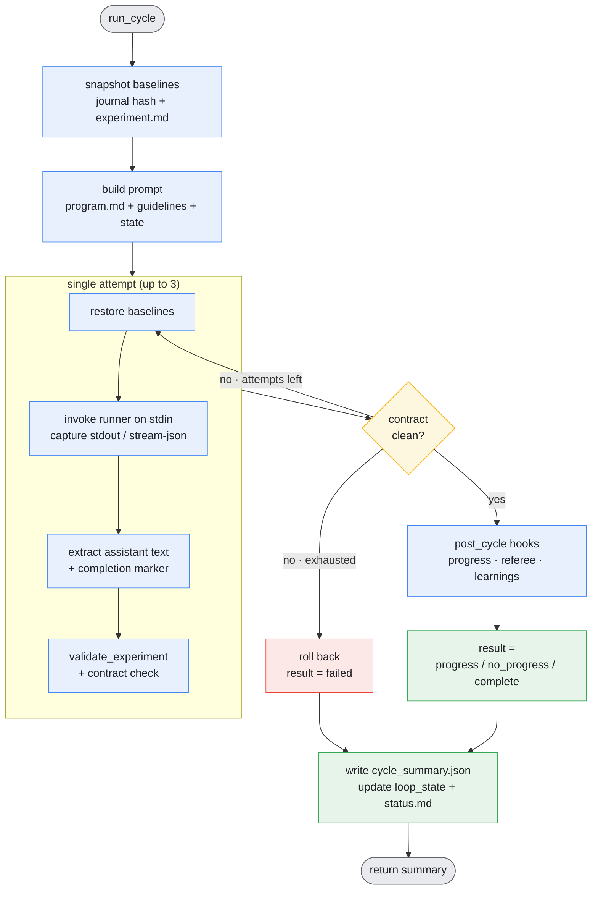
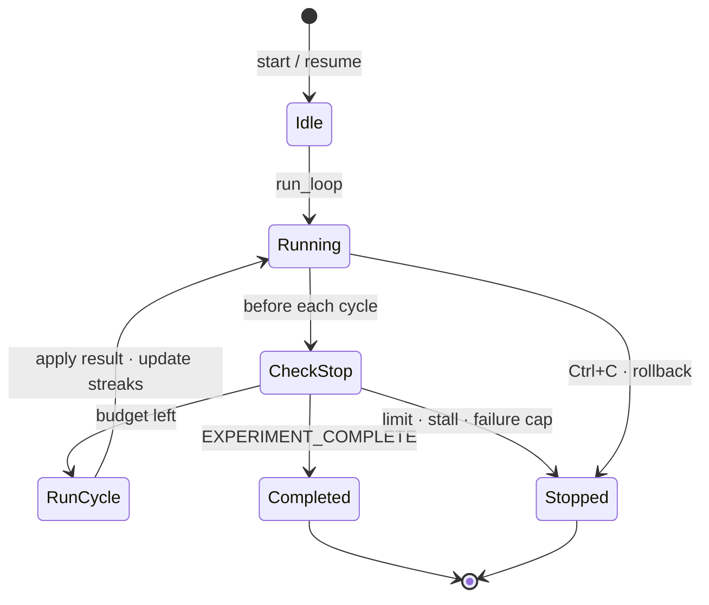

# Agentic ML Loop Architecture

Agentic ML Loop runs bounded ML research cycles against a local experiment
directory. Each cycle builds a prompt from the experiment files, invokes a
configured agent CLI, validates what the agent produced, and folds the result
into persisted state. The experiment directory is the single source of truth;
the framework never holds long-lived state of its own.

## System overview

Three views: the **components** and how they connect, the **one-cycle** flow,
and the **loop lifecycle** that decides when to stop.

### Components & boundaries

A single pipeline in cycle order: the CLI drives the supervisor, which builds a
prompt, invokes the external agent, validates the attempt, and runs post-cycle
hooks. Framework code (blue) reads and writes the experiment directory (green)
but never imports experiment code (grey) — runners are the only bridge.



### One cycle

`run_cycle` snapshots the experiment, builds the prompt, and retries one runner
attempt up to three times. Each attempt is checked against the cycle contract;
a failing attempt rolls back and retries, an exhausted cycle fails, and a clean
attempt runs the post-cycle hooks before persisting state.



### Loop lifecycle

`run_loop` evaluates stop conditions before every cycle. The common case loops
back through `RunCycle`; completion, budget limits, a stall streak, a failure
streak, or Ctrl+C end the run.



## Layout

```text
loop/                  Supervisor, prompts, state, status, runner invocation
lib/                   Shared framework helpers and demo experiment packages
runners/               Runner CLIs for bundled demos
experiments/           Experiment specs, journals, results, outputs, work
.agents/skills/        Portable skills for creating experiments and notebooks
viz/                   Optional replay generation and renderer
tests/                 Framework and demo tests
```

Framework modules must not import concrete experiment packages. Experiment
behavior lives under `lib/<experiment_id>/` and is reached through runner
registries — this keeps the supervisor generic and experiments swappable.

## The cycle contract

An attempt is accepted only when every condition holds. Any failure rolls the
experiment back to its pre-cycle snapshot and retries (up to three attempts);
once attempts are exhausted the cycle is recorded as `failed`.

- Runner exits with return code `0`.
- Output contains exactly one `<promise>…</promise>` marker, and it is
  `CYCLE_DONE` or `EXPERIMENT_COMPLETE`.
- `validate_experiment` reports no actionable errors (warnings are allowed).
- `research_journal.md` changed during the cycle.
- `experiment.md` did **not** change — the spec is immutable inside a cycle.

`EXPERIMENT_COMPLETE` is validated with stricter rules and must clear the
minimum journal-cycle count declared in `experiment.md`.

## Cycle flow

1. Snapshot baselines (`research_journal.md` hash and `experiment.md`).
2. Build the prompt from static program guidance plus dynamic experiment state.
3. Invoke the configured runner with the prompt on stdin.
4. Extract assistant text from stream JSON when present, else raw stdout.
5. Check the cycle contract; retry on failure, roll back when exhausted.
6. On success, run post-cycle hooks (progress, advisory referee, learnings),
   then persist `cycle_summary.json`, `loop_state.json`, and `status.md`.

## Stopping

`run_loop` stops before a cycle when any of these hold:

- The last cycle emitted `EXPERIMENT_COMPLETE` (unless `--run-until-limit`).
- `--max-cycles` or `--max-hours` is reached.
- Three consecutive no-progress cycles (stall) — status `stalled`.
- Three consecutive failed cycles — status `failed`.

Ctrl+C stops immediately, rolls back the active cycle, and sets status
`stopped`. A per-experiment `.loop.lock` prevents two supervisors from running
the same experiment; a stale lock from a crashed run is reclaimed automatically.

## Runner configuration

Built-in presets exist for Claude, Codex, and Cursor. A custom command can be
supplied with `--runner-command`; it receives the cycle prompt on stdin and may
return stream JSON or plain text. The resolved command, model, and timeout are
persisted in loop state and attempt metadata for reproducibility.

The presets are
`claude --print --verbose --output-format stream-json --permission-mode bypassPermissions --model claude-opus-4-8-high`,
`codex exec --dangerously-bypass-approvals-and-sandbox --model gpt-5.5-high`,
and `cursor-agent --print --trust --force --sandbox disabled --model composer-2.5`.
Override the model with `--runner-model`. Effort maps to `--effort` for Claude
and `-c model_reasoning_effort=<effort>` for Codex. Cursor has no separate
effort flag; pick a Cursor model id that already encodes effort.

## Experiment structure

```text
experiments/<experiment_id>/
  experiment.md          Immutable spec (split policy, metric, completion rules)
  research_journal.md    Per-cycle hypotheses and findings
  research_sources.md    External references gathered during research
  results.json           Candidate results
  outputs/               Deliverables a stakeholder reads
  work/                  Intermediate artifacts passed between cycles
  scripts/               One-shot scripts written during cycles
```

Use `lib.paths.outputs_dir(exp_dir)`, `work_dir(exp_dir)`, and
`scripts_dir(exp_dir)` rather than hard-coded paths; each creates the directory
on first use. The loop also writes `loop_state.json`, `status.md`, and a
`cycles/<id>/` transcript per cycle.

## Demos

The public repo ships deterministic synthetic demos that prove the harness
before pointing it at real data:

- `demo_bootstrap` — tiny classification smoke test
- `demo_classification` — synthetic binary classification
- `demo_regression` — synthetic zero-inflated revenue regression
- `demo_deep` — nonlinear tabular classification with PyTorch MLPs
  (requires `--extra deep`)

Synthetic data is generated in memory when local CSVs are absent. Generated data
files stay local and are ignored by git.
